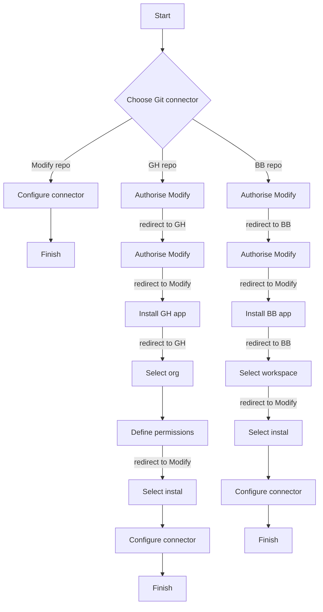

<InfoMessage header="What's a use case?" content="A use case is a list of actions or event steps defining the interactions between an actor and a system to achieve a goal"/> 

## Actors

- Human actor: Team member 
- System actors: Modify, GitHub (GH), Bitbucket (BB)

## Trigger

- Team member wants to connect to Git repo to store data, either hosted by Modfiy or an external provider (GH, BB).
- This can be triggered in the UI in 2 different places: (i) an empty repository on the repository page, or (ii) on the connector page, when the workspace's base branch is selected

## Preconditions

- Team member has logged in to Modify, created a username and completed onboarding flow
- In the case of external Git repos, the team member must have already:
  - created an account for GH or BB
  - created a Git repo
  - initlialised it
  - ensured it has at least one branch
  - pushed it to the remote

## Postconditions

- If the team member starts on the repository page, her connector will be created on the workspace base branch and shown in the repository.
- If the team member started on the connector page, she will see the connector added to the list of connectors.  

## Normal flow 

- This is the flow team members of the system connecting up external Git repos for the first time will see. 
- Subsequent attempt will follow curtailed flows (see alternate flows).

## Alternate flows 

There are various alternate flows, the main ones being for the GitHub/Bitbucket flows:

- For team members who have already authorised Modify, but have not installed the Modify app on GH/BB, they can skip to the "Install GH/BB app" step
- For team members who have already authorised Modify and have installed the Modify app on GH/BB outside of Modify (e.g. by finding it in marketplace), but not associated it with a Modify team, they can skip to the "Install GH/BB app" step
- For team members who have already authorised Modify, installed the app and associated it with a team, they can skip to the "Select instal" step.

## Exceptions 

- User downloads Modify App from GH/BB marketplaces and installs it direct. User needs to be able to associated an already installed Modify app with a team
- User uninstalls app from GH/BB. Install needs to be removed from team, and connectors using the installation need to be disabled and flagged as such to user. 

## Priority 

High

## Business rules 

- Eventually, granular RBAC will enable us to define user groups and permissions that can be associated with groups. In this flow, it is likely only team owners or admins will be able to associate an installed Modify app with a team. 